# 🩺 Project Proposal: Medeo plus ✨

## 👥 Team Members

| Name | UTORid | Email |
| :--- | :--- | :--- |
| Mianli Wang | `wangm246` | `mianli.wang@mail.utoronto.ca` |
| *Steve* | `[partner_utorid]` | `st.nguyen@mail.utoronto.ca` |

---

## 🚀 Project Overview

**Medeo plus** is a modern web application designed to revolutionize patient-provider communication and mental health support. It provides a secure and efficient platform for users to manage **Appointments**, exchange **Messages**, and share **Documents** with their healthcare providers.

This project is built on a **microservice architecture**, decoupling the core business logic from computationally intensive AI tasks. Its core innovation lies in a **Lightweight Retrieval-Augmented Generation (LightRAG)** system, powered by an **asynchronous data processing pipeline**. This enables the AI to provide highly personalized and evidence-based support by leveraging the user's conversational history and personal documents, truly acting as a private health companion.

---

## 🏗️ System Architecture

*The following Mermaid code can be pasted into an online editor like the [**Mermaid Live Editor**](https://mermaid.live) to generate a visual diagram.*

```mermaid
---
config:
  layout: elk
  theme: neo-dark
  look: neo
---
flowchart TD
  subgraph subGraph0["🖥️ User Client"]
    User["💻 User Browser"]
  end

  subgraph subGraph1["🟢 Node.js Ecosystem"]
    Express["🚀 Express.js API (port 8080)\n• /auth, /payments, /files\n• API Gateway & Business Logic"]
    SocketIO["🔌 Socket.IO\nReal-time WebSocket Channel"]
    BullMQ["🐎 BullMQ Worker\nBackground Asynchronous Task Processor"]
  end

  subgraph subGraph2["🐍 Python AI Services"]
    LightRAG["🧠 LightRAG (FastAPI:5000)\n• /rag/query\n• Text Embedding & RAG Core Logic"]
  end

  subgraph s1["🛠️ Core Services"]
    Postgres["🐘 PostgreSQL\nPrimary Database"]
    Redis["🧰 Redis\nBullMQ Task Queue"]
  end

  subgraph subGraph4["☁️ Cloud Server / Docker Compose Environment"]
    Nginx["⚙️ Nginx\nSSL / Reverse Proxy"]
    subGraph1
    subGraph2
    s1
  end

  subgraph subGraph5["🌐 Third-Party Cloud Services"]
    Supabase["📦 Supabase Storage\nS3-Compatible File Storage"]
    Qdrant["🧠 Qdrant Cloud\nVector Database"]
    Stripe["💳 Stripe Checkout\nPayment Gateway"]
    OpenAI["🤖 OpenAI API\nGPT-4o / Embeddings"]
    AssemblyAI["🎙️ AssemblyAI\nReal-time Speech-to-Text"]
    Daily["🎥 Daily.co\nVideo Call Service"]
  end

  User -- “🔒 HTTPS” --> NuxtNode["✨ Nuxt 3 SPA (port 3000)\n• OAuth Flow\n• Payment Redirect\n• Video Call Interface"]
  NuxtNode -- “🔒 HTTPS (via Nginx)” --> Express
  NuxtNode -- “🌐 WSS (via Nginx)” --> SocketIO
  Express -- “📦 Prisma ORM” --> Postgres
  Express -- “⬆️⬇️ Upload/Download Metadata” --> Supabase
  Express -- “💸 Trigger Payment” --> Stripe
  Express -- “🔍 Initiate RAG Query (gRPC/REST)” --> LightRAG
  Express -- “➕ Add Task to Queue” --> BullMQ
  BullMQ -- “🔄 Read/Write Tasks” --> Redis
  LightRAG -- “🧮 Query Vectors” --> Qdrant
  LightRAG -- “✍️ Text Embedding/Generation” --> OpenAI
  NuxtNode -- “📥 iframe Embed” --> Daily
  NuxtNode -- “🛠️ Direct WebSocket” --> AssemblyAI

```



---

## 🛠️ Tech Stack

| Layer | Technology |
| :--- | :--- |
| 🖼️ **Frontend** | Nuxt 3 (Vue 3) • TypeScript • TailwindCSS |
| 🎨 **UI Kit** | DaisyUI |
| 🚪 **Backend API Gateway** | Express.js (TypeScript) |
| ⚡ **Real-time Communication** | Socket.IO |
| 🧠 **LLM & RAG** | OpenAI GPT-4o • LightRAG (FastAPI side-car) • LangChain.js |
| 🌌 **Vector Database** | Qdrant Cloud (Starter) |
| 🔄 **Message Queue** | BullMQ + Redis |
| 🗄️ **Object Storage** | Supabase Storage (S3-compatible) |
| 💳 **Payments** | Stripe Checkout (test mode) |
| 📹 **Video Calls** | Daily.co |
| 🎤 **Speech-to-Text** | AssemblyAI Streaming API |
| 🐳 **Deployment** | DigitalOcean VM + Docker Compose + Nginx |
| 🚀 **DevOps** | GitHub Actions (Lint / CI) |

---

## ✨ Core Features & Implementation

#### a. Intelligent RAG Dialogue System

To provide a deeply personalized conversational experience, we are implementing a decoupled RAG microservice architecture.

* **Workflow:** A user's chat request first hits the **Express.js** backend. This API gateway then calls the **LightRAG (FastAPI) service**, running in a separate container, via gRPC or REST. This Python service queries the **Qdrant Cloud** vector database for relevant context, constructs a rich prompt, generates a response from **OpenAI**, and returns it to the Express gateway, which finally pushes it to the user via **Socket.IO**.

#### b. Asynchronous Data Processing Pipeline

To avoid blocking the API during intensive operations like document processing, we are introducing a message queue.

* **Workflow:** When a user uploads a document, the file is streamed directly to **Supabase Storage**. The Express API then adds a "process document" job to a **Redis** queue. A dedicated **BullMQ** worker picks up this job asynchronously to handle time-consuming tasks like transcription, embedding, and indexing into the **Qdrant** database, ensuring the main API remains fast and responsive.

#### c. Real-time Communication & Video Assistance

* **Live Chat:** All instant messaging is powered by **Socket.IO**, providing a low-latency, real-time conversational experience.
* **Video Transcription/Translation:** During video calls powered by **Daily.co**, we will stream audio through our backend to **AssemblyAI**'s streaming API. This provides high-accuracy, real-time captions, which can also be translated on the fly to a user-selected language.

---

## 🗓️ Project Milestones

#### **Alpha Version**
* **Architecture Validation:** Achieve a stable local launch of all services using Docker Compose. Debug the inter-service communication between Express and FastAPI.
* **Core Workflow:** Implement the complete user flow from OAuth registration to a successful Stripe subscription payment.
* **Basic Features:** Build the foundational UI and APIs for the Messages, Appointments, and Documents modules.

#### **Beta Version**
* **LightRAG Implementation:** Complete the RAG data indexing and retrieval pipeline, enabling personalized AI conversations.
* **Asynchronous Pipeline:** Successfully implement the document processing pipeline powered by BullMQ and Redis.
* **Feature Completion:** Integrate the real-time video transcription/translation feature and deploy the full application to a DigitalOcean VM.

#### **Final Version**
* **Optimization & Bug Fixes:** Resolve all identified bugs based on beta testing feedback. Optimize RAG retrieval efficiency and front-end performance.
* **Security Hardening:** Conduct a thorough review of all authentication, payment, and data-handling processes.
* **Documentation & Submission:** Finalize all code and documentation for submission to Gradescope.

---

## ⚙️ Local Development Setup

This project uses Docker Compose to manage its multi-container environment, ensuring consistency between development and production.

1.  **Clone the Repository**
    ```bash
    git clone https://github.com/UTSC-CSCC09-Programming-on-the-Web/project-medeoplus
    cd medeo-plus
    ```

2.  **Set Up Environment Variables**
    * In both the `backend` (Express) and `rag-service` (FastAPI) directories, copy the `.env.example` file to a new file named `.env`.
    * Populate the `.env` files with all necessary credentials for services like PostgreSQL, Stripe, OpenAI, Qdrant, etc.

3.  **Build and Run Containers**
    * Ensure you have Docker Desktop installed and running. From the project root directory, run:
    ```bash
    docker-compose up --build
    ```
    * This command will build all service images and start the containers.
    * **Frontend (Nuxt):** Available at `http://localhost:3000`
    * **Backend (Express):** Available at `http://localhost:8080`
    * **RAG Service (FastAPI):** Available at `http://localhost:5000`

---

## ⚖️ Legal & Ethical Disclaimer

⚠️ **IMPORTANT:** This is an **academic proof-of-concept project** created for educational and evaluation purposes for a university course.

* **Not a Medical Device:** This application is **not** a certified medical device. Any information, AI-generated dialogue, or summaries provided must **not** be considered professional medical advice, diagnosis, or treatment.
* **Data Privacy:** This project is designed with privacy principles in mind but has **not** undergone a formal PIPEDA or HIPAA compliance audit. Please **do not use any real Personal Health Information (PHI)** or payment credentials within the application.
